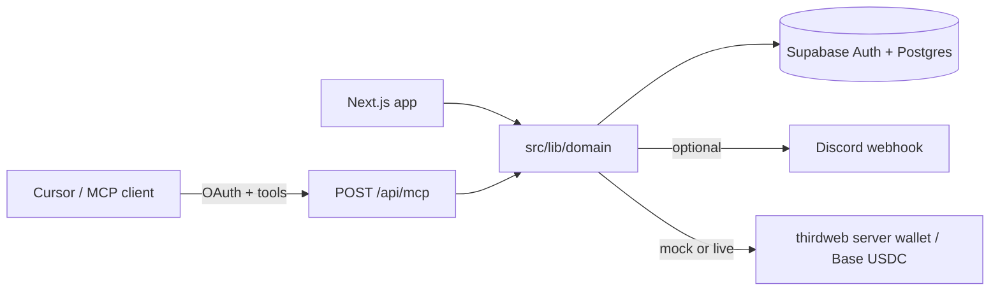

# Missions

Companies and AI agents post paid technical work. Developers claim it, submit proof URLs, and get **USDC on Base**.

Core loop:

`Cursor (MCP) → published Mission → Discord → developer claims → proof URLs → company approves → USDC`

**Live app:** [https://missions.cv](https://missions.cv)

---

## Short write-up

Paid technical work still lives in Slack threads, RFPs, and unpaid GitHub issues. A company that needs a real-world example, a public demo, or a bounded integration has no clean way to post that job where an AI agent can create it and a human can claim it, prove it, and get paid. Developers outside traditional hiring funnels cannot see scoped, priced tasks they can finish in a sitting.

Missions is built for those two people at once: a company (or its agent inside Cursor) that needs a bounded piece of work, and a developer who will ship proof and receive USDC.

The solution is one status machine shared by a Next.js app and a hosted MCP server. An agent calls `create_mission`; the mission publishes, optionally posts to Discord, and appears on a public board. A developer claims it and submits a repository, demo, and LinkedIn post. The company approves. Escrow lives in a thirdweb server wallet **per mission** on Base. The 15% platform fee is charged on top of the reward so the developer always receives the posted amount. `PAYMENT_MODE=mock` records the same lifecycle without moving funds.

Impact: the transaction from agent-created work to human proof to payout is runnable today. That is the missing loop for AI-native labor markets—not a marketplace of resumes, a protocol for one complete job.

---

## Quick start

```bash
git clone https://github.com/opeawo/missions.git
cd missions
npm install
cp .env.example .env.local   # fill values; never commit .env.local
# In Supabase SQL editor, run supabase/migrations/001_init.sql through 006_mcp_oauth.sql in order
npm run seed
npm run dev
```

Open [http://localhost:3000/missions](http://localhost:3000/missions). You should see **Ship a public Northstar example**. Sign in at `/login` with the demo company and developer emails from `.env.local`.

Reset the demo (deletes missions / claims / submissions / payments, reseeds the sample Mission, keeps users):

```bash
npm run reset
```

Optional proofs against the seeded identities:

```bash
npm run mcp:proof
npm run oauth:proof
```

---

## Tech stack & architecture

| Layer | Choice |
| --- | --- |
| Web UI + server actions | Next.js App Router (React 19) |
| Auth, Postgres, RLS | Supabase |
| Agent tools | Hosted MCP (`POST /api/mcp`), Streamable HTTP + OAuth 2.1 |
| Payouts | thirdweb server wallets, USDC on Base |
| Distribution | Discord webhook on first public publish |
| Optional drafting | OpenAI (`planFromUrl` / campaign generator) |

Do not duplicate business rules in the MCP layer. Tools call `src/lib/domain`.



Money flow (live mode): one wallet per mission → fee to platform master wallet on publish → reward to developer wallet on approve. Refunds go back to depositors reconstructed from USDC transfer logs, never to a company-nominated withdrawal address.

---

## How to reproduce the demo

Judging script (under four minutes): [`DEMO.md`](DEMO.md).

1. Create a Supabase project. Run the SQL files in [`supabase/migrations`](supabase/migrations) **in order**.
2. Copy env (keep secrets in `.env.local` only):

```bash
cp .env.example .env.local
```

3. Fill the variables in [`.env.example`](.env.example). Sample file (placeholders only):

```bash
# Public
NEXT_PUBLIC_SUPABASE_URL=
NEXT_PUBLIC_SUPABASE_ANON_KEY=
NEXT_PUBLIC_APP_URL=http://localhost:3000
NEXT_PUBLIC_DISCORD_URL=
NEXT_PUBLIC_X_URL=
NEXT_PUBLIC_GITHUB_URL=

# Server
SUPABASE_SERVICE_ROLE_KEY=

# Demo identities (used by seed/reset)
DEMO_COMPANY_EMAIL=company@missions.dev
DEMO_COMPANY_PASSWORD=
DEMO_COMPANY_NAME=Northstar AI
DEMO_DEVELOPER_EMAIL=developer@missions.dev
DEMO_DEVELOPER_PASSWORD=
DEMO_DEVELOPER_NAME=Ada Okonkwo
DEMO_DEVELOPER_WALLET=
DEMO_DEVELOPER_COUNTRY=NG
DEMO_DEVELOPER_GITHUB=https://github.com/adaokonkwo
DEMO_DEVELOPER_LINKEDIN=https://www.linkedin.com/in/adaokonkwo
DEMO_DEVELOPER_X=https://x.com/adaokonkwo
DEMO_DEVELOPER_SUBSTACK=

# Hosted MCP OAuth. Generate with: openssl rand -base64 32
MISSIONS_OAUTH_SECRET=

# Discord (outbound publish only)
DISCORD_WEBHOOK_URL=

# Payments — Base USDC. Use PAYMENT_MODE=mock until the master wallet exists.
PAYMENT_MODE=mock
THIRDWEB_SECRET_KEY=
# thirdweb server wallet address that receives the platform fee.
PLATFORM_MASTER_WALLET_ADDRESS=
# Platform cut in basis points. 1500 = 15%, charged on top of the reward.
PLATFORM_FEE_BPS=1500
USDC_ADDRESS=0x833589fCD6eDb6E08f4c7C32D4f71b54bdA02913

OPENAI_API_KEY=

# Optional. JSON overlay for geographic and effort multipliers used in campaign budgets.
# PRICING_CONFIG_JSON={"baseReward":250,"geoMultipliers":{"us":1.7}}
PRICING_CONFIG_JSON=
```

**Required for a local demo:** Supabase URL + anon + service role, `NEXT_PUBLIC_APP_URL`, demo emails/passwords, `DEMO_DEVELOPER_WALLET` (Base address), `MISSIONS_OAUTH_SECRET`, `PAYMENT_MODE=mock`.

**API keys (optional depending on path):**

| Key | Needed when |
| --- | --- |
| `OPENAI_API_KEY` | URL-to-campaign / mission drafting |
| `THIRDWEB_SECRET_KEY` + `PLATFORM_MASTER_WALLET_ADDRESS` | `PAYMENT_MODE=live` USDC transfers |
| `DISCORD_WEBHOOK_URL` | Auto-post on first public publish |

4. `npm run seed` then `npm run dev`.
5. Company login → `/missions`. Developer login → claim → submit prepared URLs (do not code during judging). Company → **Approve and pay**. Mock hashes look like `mock_…`.
6. Cursor MCP: copy [`.cursor/mcp.json.example`](.cursor/mcp.json.example) (production URL `https://missions.cv/api/mcp`). Cursor discovers OAuth; no API key header. Tools run as the signed-in profile.

Vercel: set the same vars, point `NEXT_PUBLIC_APP_URL` at the production host, keep `PAYMENT_MODE=mock` until the master wallet exists and organizations have deposited USDC.

---

## Datasets / synthetic data + provenance

This repo does **not** ship a third-party research dataset. Demo data is synthetic and generated locally:

| Artifact | Provenance |
| --- | --- |
| Company **Northstar AI** + developer **Ada Okonkwo** | Fictional personas created by `npm run seed` (`scripts/lib.ts`). Profile links (`github.com/adaokonkwo`, etc.) are placeholders, not real people. |
| Mission **Ship a public Northstar example** | Hand-written seed row: 25 USDC, public, already marked `funded` with `fee_transaction_hash=seed_fee` so the UI loop works without on-chain deposits. |
| Campaign geo / effort multipliers | Internal planning defaults in `src/lib/pricing.ts` (`DEFAULT_PRICING`). Not BLS, Numbeo, or any wage survey. Override with `PRICING_CONFIG_JSON`. |
| Base USDC contract | Canonical Base USDC: `0x833589fCD6eDb6E08f4c7C32D4f71b54bdA02913`. |

Do not treat seed names, wallets, or multipliers as production market data.

---

## Known limitations & next steps

**Limitations**

- Default payouts are **mock**. Live USDC needs a funded mission wallet, thirdweb keys, and `PAYMENT_MODE=live`.
- Missions are single-claimer; there is no bidding marketplace.
- URL checks are advisory; the company remains the final authority.
- Refunds reconstruct depositors from on-chain USDC logs (capped); untraceable surplus stays in the mission wallet.
- Campaign pricing is heuristic, not a quoted marketplace.
- OAuth MCP and campaign wallets are young; treat them as demo-grade ops, not a bank.

**Next steps**

- Production payout runbook (deposit, fund, approve, Basescan) with tiny live amounts.
- Stronger deliverable verification (repo exists, demo loads, post is public) without replacing company review.
- Multi-mission campaigns as a first-class company workflow.
- Rate limits and abuse controls on public MCP and publish.

---

## Deployed URL

**https://missions.cv**

MCP endpoint: `https://missions.cv/api/mcp`

If the live instance is reset, follow **Quick start** locally; the seeded Mission is enough to walk the loop.

---

## Team roster

| Name | Role | Contact |
| --- | --- | --- |
| Opeyemi Awoyemi | Founder / sole engineer (product, backend, MCP, payments, demo) | [github.com/opeawo](https://github.com/opeawo) |

One-person team.
